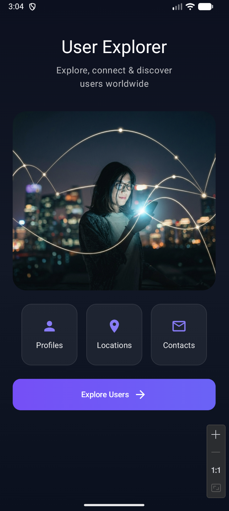
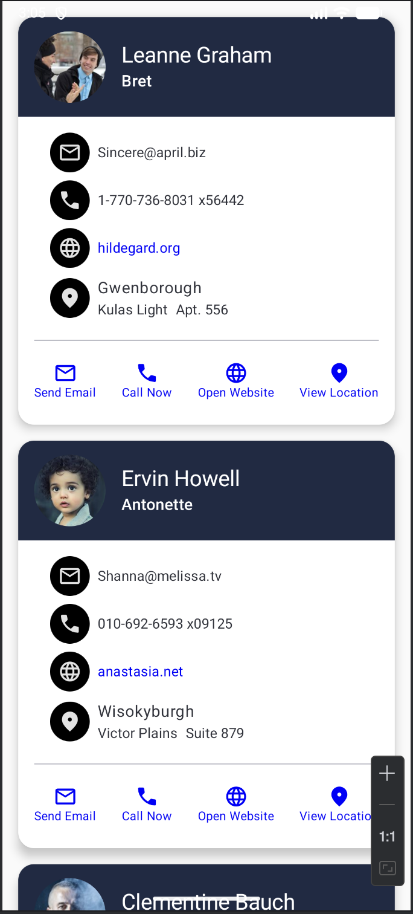

# User Explorer App

User Explorer App is a modern Android application built with **Kotlin**, **Jetpack Compose**, **MVVM**, and **Retrofit**. It allows users to browse user information retrieved from a remote REST API and perform common actions such as calling, emailing, opening websites, and viewing locations in Google Maps.

This project was developed to gain hands-on experience with modern Android development practices and architecture.

---

## Features

- Home screen with navigation to the user list
- Fetch users from REST API using Retrofit
- Display users in a modern Material 3 UI
- MVVM architecture
- Repository Pattern
- Reactive UI using StateFlow
- Navigation using Navigation Compose
- Display profile images using Coil
- Open website in browser
- Open email client
- Open phone dialer
- Open user location in Google Maps
- Loading and error state handling

---

## Screenshots
### Home Screen



### User List Screen



---

## Architecture

This project follows the **MVVM (Model-View-ViewModel)** architecture.

```
                UI (Jetpack Compose)
                        │
                        ▼
                 UserViewModel
                        │
            StateFlow<UserUiState>
                        │
                        ▼
                UserRepository
                        │
                        ▼
                  Retrofit API
                        │
                        ▼
              JSONPlaceholder API
```

### Data Flow

```
UserScreen
      │
      ▼
UserViewModel
      │
      ▼
UserRepository
      │
      ▼
Retrofit
      │
      ▼
Remote API
      │
      ▼
UserDto
      │
      ▼
StateFlow
      │
      ▼
Compose UI
```

---

## Project Structure

```
com.example.userexplorerapp
│
├── model
│   ├── UserDto.kt
│   └── UserResponse.kt
│
├── navigation
│   ├── AppNavHost.kt
│   └── Screen.kt
│
├── network
│   ├── RetrofitInstance.kt
│   └── UserApi.kt
│
├── presentation
│   ├── screen
│   │   ├── HomeScreen.kt
│   │   └── UserScreen.kt
│   │
│   ├── uiState
│   │   └── UserUiState.kt
│   │
│   └── viewmodel
│       └── UserViewModel.kt
│
├── repository
│   └── UserRepository.kt
│
├── ui
│   └── theme
│
└── MainActivity.kt
```

---

## Tech Stack

- Kotlin
- Jetpack Compose
- Material 3
- MVVM Architecture
- Navigation Compose
- Retrofit
- Gson Converter
- Kotlin Coroutines
- StateFlow
- Coil
- Repository Pattern
- Implicit Intents

---

## APIs Used

### User API

```
https://jsonplaceholder.typicode.com/users
```

### Profile Images

```
https://i.pravatar.cc/
```

---

## What I Learned

Through this project, I gained practical experience with:

- MVVM Architecture
- Repository Pattern
- Retrofit Networking
- REST API Integration
- Kotlin Coroutines
- StateFlow
- Jetpack Compose
- Navigation Compose
- UI State Management
- Material 3
- Implicit Intents
- Modern Android Project Structure

---

## Getting Started

### Clone the repository

```bash
git clone https://github.com/deepak5204/UserExplorerApp
```

### Open the project

Open the project in Android Studio.

### Sync Gradle

Allow Gradle to download all project dependencies.

### Run the application

Run the application on an emulator or a physical Android device.

---

## Future Improvements

- Hilt Dependency Injection
- Room Database
- Paging 3

---

## Author

**Deepak Kumar**

Android Developer

---

## Project Goal

The primary goal of this project was to strengthen my understanding of:

- Modern Android Development
- MVVM Architecture
- Retrofit Networking
- Repository Pattern
- StateFlow
- Navigation Compose
- Jetpack Compose
- Building scalable and maintainable Android applications